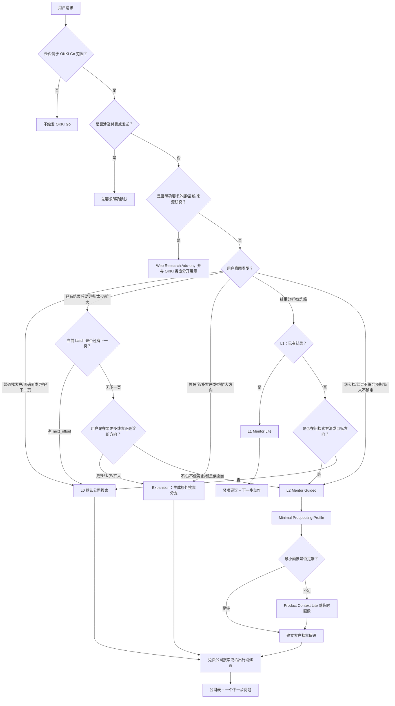
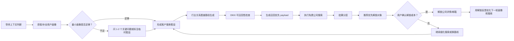
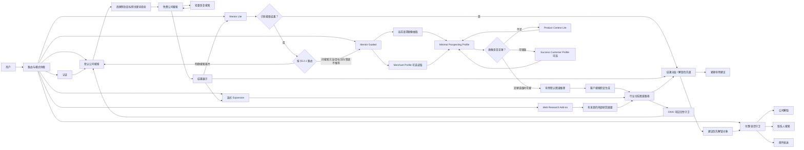

# OKKI Go 优化后导师模式与 Skill 整体设计

> 本文档按 PRD 信息结构组织：先说明背景、问题诊断和解决方案，再展开核心优化功能、整体业务流程、整体功能架构、迭代计划、功能详情、用例与验收。

## 0. 文档结构

- 背景、目标与问题诊断：说明为什么要优化，以及当前搜索和导师模式的主要问题。
- 解决方案概览：说明优化后的 Skill 定位、模式分层和边界。
- 核心优化功能：把本次优化的关键机制先集中展示。
- 优化后整体业务流程：展示模式仲裁、导师闭环和结果后转场。
- 优化后整体功能架构：说明上下文、状态、图谱、搜索、分层和付费守卫如何协作。
- 迭代计划：说明后续改写 Skill 与 eval 的建议顺序，并记录待观察挑战。
- 功能详情、用例、输出契约、来源纪律、Eval 与最终原则：作为实施和验收依据。

## 1. 背景、目标与问题诊断

### 1.1 背景与目标

本文档整理 OKKI Go Skill 在优化导师模式后的目标态设计。它不是对当前 Skill 的复述，而是描述我们讨论后达成共识的优化方向，包括：

- 导师模式的定位、触发边界和运行机制。
- 默认搜索、Expansion、Web Research、Profile、产品上下文、成功客户画像之间的关系。
- 优化后 OKKI Go Skill 的整体功能、描述、触发逻辑和架构。
- 可用于后续改写 Skill 与 eval 的验收方向。

核心共识：

> OKKI Go 的默认体验必须仍然是快速找客户；导师模式是可选增强层，主要服务初级业务员和新人业务员，帮助他们理解产品、建立客户搜索逻辑、判断下一步，而不是默认变成外部研究、长篇咨询或企业培训替代品。

**与 OKKI 可召回性守卫的关系**：守卫不是收紧搜索，而是把图谱里的「买家角色、合作模式」等多维判断从 API 过滤挪到 `local_priority_rule` 与结果分层，与「保召回、换路径不收窄」原则一致；L0 在用户已明确目标公司类型时也可单字段主搜（见 Case 2）。

### 1.2 问题诊断

| 问题 | 影响 | 本次优化方向 |
|---|---|---|
| 默认找客户容易被导师模式、画像采集或外部研究拖慢 | 成熟用户只想快速拿候选公司，却被迫进入咨询流程 | L0 默认快速免费搜索，导师模式只在用户需要分析、策略、新人指导或结果判断时触发 |
| 新人不知道应该找哪类客户、用什么客户路线搜索 | 容易搜成同行、供应商或路径不相关公司 | L2 Mentor Guided 用 Minimal Prospecting Profile 和行业关系图谱生成可执行客户路线 |
| 已展示结果后，“更多 / 太少 / 扩大一点”容易被机械路由 | 有时应该翻页，有时应该换路线，模型容易凭话术误判 | 引入确定性分页规则：有下一页就翻页，无下一页才考虑 Expansion、同路线恢复或 L2 诊断 |
| 图谱路径容易被误实现为更多 AND 条件 | 复杂制造业搜索可能更精准但 0 结果 | OKKI 可召回性守卫要求首轮优先单主字段 + 国家，角色/合作模式优先进入本地分层 |
| 结果后缺少解锁优先级 | 用户不知道哪些公司值得花 credit 验证 | L1/L2 输出“优先解锁 / 观察 / 暂不推荐”和下一步动作 |
| Web Research、付费解锁、发信容易越界 | 搜索流程被外部研究拖慢，或误触发付费动作 | Web Research 必须显式触发；所有付费和发信动作必须单独确认 |

### 1.3 导师模式的用户定位

导师模式最适合的人群是：

- 初级业务员或新人业务员。
- 刚接手新产品线、新市场、新区域的业务员。
- 对产品、应用场景、客户类型还不熟的人。
- 复杂制造业、设备类、定制类产品的外贸或 B2B 销售。

尤其适用于：

- 仪器、检测设备、精密设备。
- 自动化机械、产线设备。
- 高度定制化工艺产品。
- 工业零部件、材料、组件。
- OEM/ODM、项目制、集成制、工艺相关产品。

这些行业里，新人最大的卡点往往不是“不知道怎么点搜索”，而是：

- 不知道产品到底解决客户什么问题。
- 不知道客户画像应该怎么定义。
- 不知道该找终端工厂、经销商、集成商、工程商还是服务商。
- 容易把同行制造商搜出来。
- 不知道哪些线索值得优先联系。
- 不知道联系客户时第一步该问什么。

因此，导师模式的价值不是替代企业内部产品培训，而是帮助新人把有限产品信息转成可执行的客户开发动作。

### 1.4 导师模式的核心定位

#### 1.4.1 它是什么

导师模式是 OKKI Go 搜索流程上的“销售判断层”和“新人教练层”。

它可以帮助用户：

- 把模糊产品描述转成客户搜索假设。
- 判断应该优先找哪类客户。
- 构建行业关系图谱，沿客户侧关系边找到可召回路径，例如直接使用、渠道/转售、品牌/OEM、集成/工程、服务/改造和项目触发方。
- 识别搜索方向中的风险和盲点。
- 将结果转成下一步开发动作。
- 把导师判断落到可执行搜索、结果分层和解锁优先级。
- 在上下文不足时，提醒用户补充最关键的产品信息。
- 基于成功客户画像，优化 ICP 和搜索路线。

#### 1.4.2 它不是什么

导师模式不是：

- 默认市场研究。
- 默认外部 web research。
- 长篇咨询报告。
- 完整企业 onboarding。
- 产品知识库的替代品。
- 可以无上下文给出确定性技术判断的专家系统。

当缺少企业上下文或产品知识库时，导师模式必须诚实降级：

> 当产品/企业上下文不足时，导师模式应作为“产品信息提取教练 + 销售流程教练”，而不是假装自己是产品专家。

## 2. 解决方案概览

### 2.1 优化后的 Skill 描述

建议目标态描述：

```text
OKKI Go 是用于 B2B 潜客开发和外联的 Skill，可搜索目标公司、解锁公司详情、查找决策人邮箱、起草/发送冷启动邮件、查询额度和邮件状态，并在用户需要结果优先级、解锁建议、新人客户路线指导或销售策略梳理时，提供有边界的导师帮助。默认行为是快速免费公司搜索。导师模式只在用户要求分析、策略、新人指导或结果判断时触发，不应默认变成外部研究、产品 onboarding 或长篇咨询。若用户明确要在 1688、Alibaba、Google Maps、Amazon、LinkedIn 或其他平台搜索，不触发 OKKI Go。也不用于收件箱、CRM、销售预测或账号设置管理。
```

### 2.2 优化后的模式分层

优化后的 OKKI Go 不应只有“开/关导师模式”一个粗粒度状态，而应有三层：

| 层级 | 模式 | 触发 | 核心行为 |
|---|---|---|---|
| L0 | 默认搜索 | 普通找客户、找买家、找公司；或只是要更多同类结果 | 先搜索，展示公司表，问下一步 |
| L1 | Mentor Lite | 用户要求分析已有结果、优先级、解锁顺序、下一步 | 基于已有结果，默认按行业关系图谱和客户侧角色给紧凑建议 |
| L2 | Mentor Guided | 用户在问怎么搜、有没有更好搜法、结果为什么不符合预期、目标客户方向是否错了、新人如何找客户 | 默认用行业关系图谱建立客户假设、推荐搜索路线，再搜索或给行动建议 |

核心边界：

- 默认搜索解决“帮我找 / 再给我一些同类结果”。
- Expansion 解决“还可以换哪些方向搜 / 除了当前客户类型还能找谁 / 当前 batch 已经没有下一页时，如何有条理地扩大召回”。
- Mentor Guided 解决“为什么这样搜、该不该这样搜、应该先搜谁”。

#### 2.2.1 L0 默认搜索

适用话术：

- “帮我找德国汽配进口商”
- “找 30 个美国门锁经销商”
- “先给我看看候选公司”
- “直接搜”
- “继续找”
- “更多”
- “换一批”
- “还有更多吗？”
- “再给我 20 个类似的”
- “下一页”

注意：“更多 / 继续找 / 换一批”默认仍按 L0 理解，但不是机械规则。确定规则是：只要当前 batch 仍有下一页，就先翻页；只有当前路线没有下一页，才根据用户目标和结果状态判断同路线改写恢复、Expansion 或 L2 诊断。

默认搜索不能默认触发：

- 产品知识采集。
- 成功客户画像提问。
- Business Context 问卷。
- Sales Journey Preview。
- 外部研究。
- 长篇销售咨询。

#### 2.2.2 L1 Mentor Lite

适用话术：

- “这些结果优先联系谁？”
- “这批哪些先解锁？”
- “哪些看起来不像目标客户？”
- “帮我分析这批客户”
- “下一步怎么开发？”
- “这个方向靠谱吗？”
- “哪些方向不推荐？”
- “这些结果是不是目标客户？”

输出应很短，通常只包含：

- 优先级建议。
- 一个风险或盲点。
- 一个下一步动作。

Mentor Lite 进入后不需要用户额外说“按行业关系图谱分析”。只要结果或上下文允许，它默认用图谱路径、客户侧角色和买家合理性判断来解释“谁更值得先看”。

##### 2.2.2.1 L1 前置条件与路由

| 条件 | 路由 |
|------|------|
| 当前会话已有免费搜索结果 | 直接进入 L1，基于结果字段做分层，**不主动补问画像** |
| 无结果且用户在问「靠谱吗」「哪些不推荐」「该找谁」「怎么搜才对」 | 升级到 L2：先形成 MPP 与搜索假设，再搜索 |
| 无结果但用户同时给出明确搜索条件 | 先 L0 搜索；有结果后再 L1 |
| 「找客户 + 告诉我先解锁哪些」 | L0 搜索 → 结果后自动 L1 |
| 会话中从 L0 说「帮我分析这批」 | 保持当前 batch，升级到 L1，不重新搜索 |

#### 2.2.3 L2 Mentor Guided

适用话术：

- “开启导师模式”
- “有没有更好的搜索方式？”
- “这些结果不是我想要的”
- “我觉得结果不是很符合预期”
- “我搜出来的公司不太对”
- “你能教我怎么搜这个产品吗？”
- “我不知道该用什么关键词”
- “我是不是搜错方向了？”
- “为什么搜出来都是供应商，不像买家？”
- “我刚接手这个产品，不确定该找哪类客户”
- “我不熟这条产品线，先帮我判断应该找谁”
- “帮我先判断应该找经销商、工厂还是集成商”
- “这个产品客户路线不清楚，先帮我跑几个方向”
- “先帮我理清该找什么客户”
- “我不知道这个产品适合哪些客户”
- “帮我规划客户开发路径”
- “帮新人业务员一步步跑”

Mentor Guided 可以问少量上下文问题，但目标仍然是尽快形成可搜索假设或下一步动作，不是进入长问卷。

一旦进入 Mentor Guided，“按行业关系图谱搜索”就是默认工作方式，不是需要用户显式触发的额外能力。用户显式说“按行业关系图谱帮我拆”时，只是要求把这套默认推理过程更可见地展示出来。

默认用户可见表达应尽量使用“客户路线”“先搜哪类公司”“为什么这类更可能相关”“哪些先别解锁”，而不是要求用户理解“行业关系图谱”这个内部术语。

## 3. 核心优化功能

### 3.1 核心优化点概览

| 核心优化点 | 解决的问题 | 关键规则 |
|---|---|---|
| L0 默认搜索反导师化 | 用户只要候选公司时不被长咨询打断 | 先免费搜索，展示公司表和一个下一步问题 |
| Expansion 状态驱动扩召回 | “太少 / 不够 / 扩大一点”不再靠话术误判 | 当前 batch 有下一页就翻页；无下一页且用户仍要更多可用潜客时，给 2-3 个新客户路线分支 |
| Mentor Lite | 用户已有结果后需要判断优先级 | 基于当前 batch 做紧凑分层，不主动补问画像、不重新搜索 |
| Mentor Guided | 新人或复杂产品需要搜索方法指导 | 形成 MPP，生成客户路线，经可召回性守卫转成搜索 payload |
| OKKI 可召回性守卫 | 避免把图谱路线实现成过窄 AND 搜索 | 首轮默认单主字段 + 国家；角色词优先用于本地分层 |
| 会话状态与分页状态 | 多轮 follow-up 不丢上下文 | 保存 latest batch、next_offset、graph_paths、search_action_id 和 recovery 状态 |
| Web Research Add-on | 外部研究不污染默认找客户 | 仅用户明确要求时触发，并与 OKKI 搜索分开展示 |
| 付费与发信守卫 | 避免误花 credit 或误发邮件 | 解锁、联系人搜索、邮件发送都必须显式确认 |

### 3.2 功能关系总表

| 功能/机制 | 默认触发 | 触发条件 | 可免费搜公司 | 可付费 | 可外部研究 |
|---|---:|---|---:|---:|---:|
| 默认公司搜索 | 是 | 普通找客户请求 | 是 | 否 | 否 |
| 轻量恢复搜索 | 条件触发 | 首轮结果弱 | 是 | 否 | 否 |
| Expansion | 否 | 用户要换角度、补客户类型、扩大搜索分支；或已展示结果后要更多可用潜客且当前 batch 无下一页 | 是 | 否 | 否 |
| Mentor Lite | 否 | 用户要分析/优先级/下一步 | 通常基于已有结果 | 否，可建议解锁但需确认 | 否 |
| Mentor Guided | 否 | 用户要搜索方法指导、结果偏差诊断、新人帮助或策略 | 是 | 否，可建议解锁但需确认 | 否 |
| Minimal Prospecting Profile | 导师模式内条件触发 | L2 生成图谱前必须；L1 有结果时仅反推、不主动采集 | 间接支持 | 否 | 否 |
| 导师默认图谱推理 | 导师模式内默认 | 内置机制；L2 必用；L1 有结果时用于分层解释 | 是，转成搜索路线 | 否 | 否 |
| OKKI 可召回性守卫 | 导师/L0 条件触发 | 图谱路径或 payload 生成前；首轮默认单主字段 + 国家 | 是，保召回 | 否 | 否 |
| Product Context Lite | 否 | 仅 L2 且 MPP 有单点缺口；不持久化 | 间接支持 | 否 | 否 |
| Product Brief | 否 | 用户要求保存/复用产品知识 | 间接支持 | 否 | 否 |
| Success Customer Profile | 否 | 高精度 ICP/导师分析 | 间接支持 | 否 | 否 |
| Web Research Add-on | 否 | 用户明确要求外部/最新/来源 | 间接支持 | 否 | 是 |
| 公司解锁 | 否 | 用户选公司并确认成本 | 否 | 是 | 否 |
| 联系人搜索 | 否 | 用户要联系人并确认成本 | 否 | 是 | 否 |
| 邮件起草 | 否 | 用户要求起草 | 否 | 否 | 否 |
| 邮件发送 | 否 | 用户确认收件人和内容 | 否 | 是 | 否 |

## 4. 优化后整体业务流程

### 4.1 模式仲裁逻辑



优先级规则：

1. 付费和发信确认永远优先。
2. 外部研究必须由用户明确触发。
3. 导师模式必须由用户明确需要指导、分析、策略或新人帮助触发。
4. 行业关系图谱不是独立触发条件；进入 Mentor Lite 或 Mentor Guided 后默认作为搜索推荐和结果判断的思路。
5. 普通找客户请求默认走快速免费搜索，不展开导师图谱讲解。
6. 用户说“直接搜”“只要候选公司”“不要导师”，必须尊重。
7. 用户说“更多 / 太少 / 不够 / 扩大一点”时，不只看话术；必须先看当前 batch 是否还有下一页。有下一页就 L0 翻页；无下一页时，再结合用户目标、结果质量、噪声类型和恢复状态判断是同路线恢复、Expansion 还是 L2。

##### 4.1.1 灰区路由表

| 用户说法 | 路由 |
|----------|------|
| 「我们是 XX 厂，找海外客户」 | 目标公司类型明确 → L0；仅说「海外客户」、路线不清 → L2 |
| 「先别搜，帮我理清该找谁」 | L2（可先给假设，暂不搜索） |
| 「继续找 / 更多 / 下一页 / 再给我 20 个」且当前 batch 有 `next_offset` | L0 翻页；不自动重置恢复预算，也不默认用满恢复预算 |
| 「继续找 / 更多 / 换一批」但当前 batch 无下一页，且用户要更多可用潜客 | 不要求用户显式说“换方向”；转入 Expansion 候选分支，给 2-3 个可选扩展方向，用户确认后只执行 1 条新分支 |
| 已有结果后说「结果太少了 / 不够 / 帮我扩大一点 / 再多找点」 | 先看分页：有下一页就 L0 翻页；无下一页且首轮/恢复后仍弱，则 Expansion；不再默认做隐藏式多轮恢复 |
| 尚未展示结果时系统发现结果太少 | 可做最多 1 次轻量恢复；若总等待接近 60 秒，立即展示当前结果或给可选扩展方向 |
| 「除了经销商还能找谁 / 不要只搜这类，换个方向」 | Expansion：在已有假设上补充新的客户类型、应用场景或合作模式 |
| 「结果不是我想要的 / 搜出来不太对 / 你能教我怎么搜吗」 | L2：重新形成 MPP、买家合理性判断和搜索假设 |
| 「我搜出来都是供应商，不像买家」 | L2：优先做买家侧关系重构，不把供应商/同行默认当潜客 |
| 「找客户，顺便查最新市场趋势」 | OKKI 搜索与 Web Research 分开展示；**研究结论不得自动改写** search payload，仅可作 L2 补充上下文，须用户确认后再搜 |
| 会话中 L0 →「这批哪些先解锁」 | 升级到 L1 |

##### 4.1.2 L1 / L2 对 MPP 与图谱的要求

| 模式 | MPP | 行业关系图谱 | 主动补问 |
|------|-----|--------------|----------|
| L1（有结果） | 从当前请求 + 已有结果反推即可 | 用结果字段 + 当前假设做分层 | **不主动补问**；缺口标为「观察」 |
| L1（无结果） | — | — | 若用户问搜索方法、目标方向、靠谱不推荐则升 L2；若只是明确搜索条件或要同类更多则先 L0 |
| L2 | 必须形成最小卖家 + 临时目标客户画像 | 必须生成图谱路径并经 OKKI 可召回性守卫 | 最多 1-2 个关键问题（Product Context Lite） |

#### 4.2 导师模式的执行闭环

导师模式的最终目的不是给出建议本身，而是提高用户搜索到“路径相关、值得验证”的公司的概率，并提高用户愿意解锁、且解锁后确实有价值的概率。

这里的“值得验证”不能简单理解为添加更多搜索条件或使用更窄关键词。对复杂制造业来说，过度收窄经常会导致 0 结果。更可行的策略是：先获取足够的用户画像，形成最小卖家画像和临时目标客户画像；再保留召回，构建行业关系图谱，把卖家能力、合作模式、下游行业、买家代表公司类型拆成多条可解释路径，搜索后再判断哪些公司更值得解锁。

因此，L2 Mentor Guided 必须尽量回到下面的完整闭环；L1 Mentor Lite 在已有结果时只执行“结果分层 -> 解锁建议 -> 反馈修正”的轻闭环，不主动补问画像、不重新搜索。



导师模式至少要产出以下可落地对象之一：

| 产出 | 用途 |
|---|---|
| 最小卖家画像 | 明确“用户卖什么、能力边界、适合什么应用” |
| 临时目标客户画像 | 明确“谁可能买/指定/转售/使用，为什么” |
| 搜索假设 | 明确“这次要找哪类客户，为什么” |
| 行业关系图谱路径 | 明确“卖家能力 -> 合作模式 -> 下游行业 -> 买家代表公司类型” |
| 客户侧关系扩展策略 | 在图谱路径内决定是否沿直接使用、渠道/转售、品牌/OEM、集成/工程、服务/改造、项目触发等关系边继续扩展 |
| OKKI 可召回性检查 | 判断这条路线应该用哪个字段先搜，哪些维度只用于本地分层 |
| 目标侧关键词 | 转成 `productKeywords` / `companyTypeKeywords` / `industryKeywords` |
| 排除方向 | 避免搜同行、路径不相关路线或不适合客户 |
| 解锁优先级规则 | 告诉用户哪些结果更值得花 credit 查看 |
| 下一步动作 | 解锁、继续搜索、补产品上下文或换路线 |

内部可以使用“行业关系图谱路径”作为结构化产物；面向普通用户时，应优先翻译成“客户路线”和“优先验证原因”。只有当用户显式要求看图谱拆解，或文档/eval 需要验收内部逻辑时，才展示完整路径术语。

导师模式不能跳过画像层直接生成图谱。画像不足时可以先用临时假设启动搜索，但必须标注“不确定点”，并把最关键的缺口变成一个问题或下一步验证动作。

结果展示后，导师模式应把公司分为 2-3 个轻量层级，而不是只给泛泛建议：

| 层级 | 含义 | 用户动作 |
|---|---|---|
| 优先解锁 | 与行业关系图谱路径、应用场景或客户路线最相关 | 建议先选 3-5 家确认成本后解锁 |
| 观察/待验证 | 有部分路径信号，但缺少关键应用、客户关系或角色信号 | 可先保留，等补上下文后再判断 |
| 暂不推荐 | 可能是同行、泛行业、路线不清或与成功客户画像冲突 | 暂不花 credit |

注意：

- 解锁优先级只是导师建议，不能替代用户的付费确认。
- 不应建立沉重的黑箱评分模型；优先使用结果字段、行业关系图谱路径、用户目标、Product Brief、Success Customer Profile 和固定 playbook 规则。
- 不应为了表面精准不断增加 AND 条件。导师模式应优先拆图谱路径、换层级、换关系边，而不是单纯收窄关键词。
- 如果结果弱，导师模式要先回到搜索假设修正，而不是催用户解锁。
- 如果召回可用且路径清晰，导师模式要明确建议“先解锁哪几类/哪几家公司验证”，而不是只说“这些都不错”。

## 5. 优化后整体功能架构

### 5.1 关键上下文层

优化后的导师模式不应依赖单一上下文，而是按层使用信息。上下文越多，指导越准；上下文不足时，导师必须降级，不应编造。

#### 5.1.1 当前用户请求

当前请求永远是本次搜索的最高优先级信息。

可能包含：

- 产品或服务。
- 目标国家/区域。
- 买家路线。
- 公司类型。
- 销售目标。
- 排除条件。
- “直接搜”“不要导师”“不要问”等明确指令。

#### 5.1.2 Merchant Profile

Merchant Profile 是可选记忆，不是默认门槛。

可包含：

- 企业所在国。
- 产品品类。
- USP。
- 目标客户基线。
- 外联身份。
- 排除项。
- 销售上下文。

规则：

- **懒加载**：L0 仅在有助于构造搜索时低成本读取；L1 有结果时不为补问而读 Profile；L2 画像不足时可读。
- 当前用户请求覆盖 Profile。
- Profile 不完整不能阻塞第一次免费搜索。
- 当前轮新事实不能默认保存，必须用户确认。
- Success Customer Profile 同理：仅 L2 高精度 ICP 或用户主动提供时读取，L0/L1 默认不问。

#### 5.1.3 Minimal Prospecting Profile

Minimal Prospecting Profile 是导师模式生成行业关系图谱前必须形成的最小画像。它不是完整 onboarding，也不是企业知识库，而是为了回答三个问题：

1. 用户卖什么，能力边界是什么？
2. 谁可能买、指定、转售、集成、维护或使用它？
3. 当前搜索先验证哪条客户路线？

它由两部分组成：

| 画像 | 必填程度 | 字段 | 用途 |
|---|---|---|---|
| 最小卖家画像 | 必须尽量形成 | 产品/服务、合作模式、应用场景或解决的问题、目标市场、排除方向 | 决定图谱起点和不能误搜的方向 |
| 临时目标客户画像 | 必须尽量形成 | 买家类型、客户为什么买、所在行业/场景、采购/指定/转售/使用角色 | 决定客户路线、搜索 payload 和解锁优先级 |
| 真实成功客户画像 | 可选增强 | 已成交客户类型、行业、国家、采购原因、失败反例 | 校准 ICP 和优先级，不是默认搜索门槛 |

获取顺序：

1. 先从当前用户请求抽取，例如“自动化点胶设备”“德国”“刚接手”“不知道找哪类客户”。
2. 再读取低成本 Merchant Profile，如果存在且不与当前请求冲突。
3. 如果进入导师模式且画像不足，只问 1-2 个最能影响搜索路线的问题。
4. 如果问题暂时答不上来，用“临时画像”先跑 1-2 条可召回路线，并把缺口放到结果后的下一步。

最小问题模板：

| 缺口 | 可问问题 | 为什么问 |
|---|---|---|
| 不知道应用行业 | “这个产品主要用在电子、汽车、医疗、包装，还是其他工艺？” | 决定下游应用路线和关键词 |
| 不知道合作模式 | “你们更像卖标准设备、做定制项目，还是找代理/分销？” | 决定找终端工厂、集成商、渠道商还是品牌/OEM |
| 不知道客户类型 | “过去比较像客户的是工厂、经销商、集成商，还是品牌方？” | 校准临时目标客户画像 |
| 不知道排除项 | “有没有明显不想找的对象，比如同行设备厂或纯软件公司？” | 降低误搜和错误解锁 |

规则：

- 画像主动采集只在 **L2 Mentor Guided** 或搜索不可构造时使用；L1 有结果时只反推、不补问。
- 默认公司搜索（L0）不先做画像采集。
- 不要把画像问题变成长问卷；够形成一个可搜索假设就停止提问并回到搜索。
- 当前轮形成的 Minimal Prospecting Profile 默认只用于本轮搜索和解锁判断，不自动写入长期 Profile；保存或复用必须由用户确认。
- 画像字段不能直接全部塞进 OKKI payload，不支持的字段只用于本地判断、结果分层、联系人搜索或外联话术。
- 画像越不完整，输出越要使用“临时判断/先验证”措辞。

#### 5.1.4 Product Context Lite 与 Product Brief

二者是同一产品上下文的不同形态，避免重复提问：

| 概念 | 定义 | 持久化 | 触发 |
|------|------|--------|------|
| **Product Context Lite** | 导师模式下的 1-2 个即时补问，只为本轮搜索服务 | 否，默认不落盘 | L2 且 MPP 缺口影响路线选择；搜索不可构造 |
| **Product Brief** | 用户明确要求保存/复用的轻量产品知识卡 | 是，须用户确认 | 用户说「保存产品信息」「下次还用」；或多次同产品线开发 |

规则：

- 同一轮内 **Lite 与 Brief 不重复问同一字段**；Lite 够形成假设即停止。
- L0 默认搜索、L1 结果判断均不触发 Lite 或 Brief 采集。
- §6 流程图中的「Product Context Lite 或临时画像」指 Lite 补问；Brief 仅在用户要持久化时写入。

**Product Brief** 建议字段（完整知识卡，非默认门槛）：

适合复杂制造业和新人场景。建议字段：

| 字段 | 用途 |
|---|---|
| 产品/设备名称 | 基础锚点 |
| 应用场景 | 判断客户在哪里使用 |
| 解决的工艺/生产问题 | 判断客户为什么买 |
| 目标行业 | 用于搜索和分组 |
| 典型客户类型 | ICP 和路线选择 |
| 买家角色 | 后续联系人和邮件 |
| 关键参数/认证/门槛 | 资格判断和风险提醒 |
| 定制化程度 | 判断销售周期和客户适配 |
| 交付/使用场景 | 优化客户路线 |
| 不适合客户 | 反向推荐和避坑 |

**Product Brief 持久化触发**（与 Lite 区分）：

- 用户要求保存或复用产品知识。
- 同产品线多轮开发且用户确认写入。

**Product Context Lite 触发**（即时补问，不持久化）：

- L2 且 MPP 有单点缺口（应用行业、合作模式、客户类型、排除项之一）。
- 搜索不可构造，因为产品信息太少。

不应在 L0 默认搜索前要求 Lite 或 Brief。

#### 5.1.5 Success Customer Profile

Success Customer Profile 是过往成功交易客户画像。它对导师模式非常有价值，因为它能从真实成交结果反推 ICP，而不是只靠模型猜。

有用字段：

| 字段 | 价值 |
|---|---|
| 成交客户国家/区域 | 判断市场优先级 |
| 行业/品类 | 识别真实 ICP |
| 公司类型 | 进口商、经销商、工厂、集成商、品牌方等 |
| 公司规模 | 避免客户过大或过小 |
| 采购产品/应用场景 | 把“我卖什么”转成“客户为什么买” |
| 买家角色 | 后续找联系人和外联切入 |
| 成交原因 | 提炼 USP 和 first-touch angle |
| 线索来源 | 判断渠道策略 |
| 复购/客单价/毛利区间 | 判断优先级 |
| 失败或不适合客户反例 | 生成 not recommended 路线 |

规则：

- 只在导师模式、高精度 ICP、结果优先级分析时询问或复用。
- 默认搜索不问。
- 优先匿名或聚合描述。
- 不默认要求客户名称、个人数据、收入等敏感信息。
- 不能授权任何付费动作。

#### 5.1.6 旧 Sales Mentor 模块迁移映射

落地本方案时，现有 `sales-mentor-playbook.md` 中下列模块应退役或并入新分层，避免双轨并行：

| 旧模块 | 新归属 | 说明 |
|--------|--------|------|
| PMF Gate | 移除默认路径 | 不再阻塞首次免费搜索 |
| BC1/BC2/BC3 问卷 | L2 的 MPP + Product Context Lite | 合并为最多 1-2 问，不单独成段 |
| Blind-Spot Checklist | L1/L2 的「风险/盲点」单条 | 不单独输出清单章节 |
| Sales Journey Preview | L1/L2 的「优先解锁 / 观察 / 暂不推荐」 | 不再默认 viewed 三分组流程 |
| Reverse Recommendations | Expansion + L2 的 `avoid` / 暂不推荐 | `not_recommended` 须有来源 |
| Business Context Lite（旧称） | Product Context Lite（§7.4） | 统一命名，仅 L2 即时补问 |

### 5.2 优化后功能架构

#### 5.2.1 会话状态（Session State）

多轮对话应维护轻量状态，避免 L0→L1 升级或 L2 换路线时丢上下文：

```json
{
  "mode": "L0 | L1 | L2",
  "last_batch_id": "...",
  "search_action_id": "...",
  "current_route": {
    "route_id": "route_a",
    "route_label": "渠道/转售路线",
    "search_payload": {},
    "local_priority_rule": "...",
    "status": "usable | low_yield | diagnosis_needed | unknown"
  },
  "last_batch_stats": {
    "shown_count": 20,
    "available": 86,
    "next_offset": 20,
    "has_next_page": true,
    "priority_count": 6,
    "observe_count": 8,
    "not_recommended_count": 3,
    "peer_supplier_noise_count": 2
  },
  "mpp_snapshot": { "seller": {}, "target_customer": {}, "provisional": true },
  "graph_paths": [
    { "graph_path_id": "route_a", "status": "candidate | searched | confirmed | exhausted | not_recommended" }
  ],
  "recovery": {
    "hidden_rounds_used": 0,
    "hidden_round_limit": 1,
    "hard_limit": 3
  },
  "user_feedback": {
    "last_followup_intent": "more | too_few | not_fit | analyze | unlock"
  }
}
```

- `search_action_id` 表示一次用户可见的搜索动作。首轮搜索、用户确认后的 Expansion 新分支、用户明确改变条件后的重搜，都是新的 `search_action_id`。
- `recovery.hidden_rounds_used` 只统计当前 `search_action_id` 内的自动恢复轮次；默认最多 1 轮，硬上限 3。用户确认 Expansion 新分支后，开启新的 `search_action_id` 和新的轻量恢复预算，但不得把多条图谱路径隐藏在同一次动作里自动跑完。
- `current_route.status` 必须在每次展示结果后更新，用于判断后续“更多 / 太少 / 扩大一点”在无下一页时走同路线恢复、Expansion 还是 L2 诊断。
- 「更多」「换一批」「继续找」「太少」「不够」不自动重置恢复预算。若 `has_next_page=true`，必须优先 L0 翻页；若 `has_next_page=false`，再根据用户目标和当前路线状态进入同路线恢复、Expansion 或 L2。只有用户确认新方向、新条件或 Expansion 分支，才开启新的搜索动作。

##### 5.2.1.1 分页优先与路线状态判定（P0）

Expansion 不能依赖模型主观感觉，也不能只看用户话术。模型必须先执行确定性的分页规则，再判断路线状态：

1. 若 `has_next_page=true` 或 `next_offset` 存在且小于 `available`，用户说“更多 / 继续 / 下一页 / 换一批 / 太少 / 不够 / 再多找点”时，一律先 L0 翻页。
2. 只有 `has_next_page=false`、`next_offset` 为空，或 `available <= next_offset` 时，才允许考虑 Expansion、同路线恢复或 L2 诊断。
3. 如果 batch 状态缺失或过期，不得凭感觉 Expansion；应优先复用最新 batch，必要时说明需要重新跑一次免费搜索来恢复分页状态。

在无下一页时，每次结果展示后应基于 `last_batch_stats` 给当前路线打一个轻量状态：

| 状态 | 判定信号（满足其一或组合判断） | 后续路由 |
|------|------|------|
| `paged` | 当前 batch 有下一页 | 后续更多请求必须先 L0 翻页，不进入 Expansion |
| `exhausted_usable` | 无下一页，但结果里仍有足够优先/观察候选，用户只是想继续同类 | 可提示“当前方向已到底”，建议解锁/分析现有结果；若用户坚持继续同类，可做 1 次同路线关键词改写恢复 |
| `low_yield` | 无下一页，且展示结果稀疏、轻量恢复后仍弱，或用户反馈“太少/不够/再多找点” | 给 2-3 个 Expansion 候选分支，用户确认后只搜 1 条 |
| `diagnosis_needed` | 无论是否有下一页，只要用户反馈“不符合预期/都是供应商/不像买家”，或结果主要落在同行、供货商、同侧生态节点 | 进入 L2，重构买家合理性、MPP 和搜索假设；若用户只是要求更多且有下一页，可先翻页并提示可稍后诊断 |
| `unknown` | batch 缺失、过期、统计不足或字段不足以判断 | 优先复用最新 batch；仍不可判断时，给一个简短选择：继续同路线，或换客户路线 |

初始阈值建议保持简单、可调：

- 稀疏：首屏结果少于目标 `size` 的 40%，或默认 20 条搜索中少于 8 条可展示候选。
- 现有结果可继续验证：`priority_count + observe_count` 不低于 40%，且 `not_recommended_count` 不高于 60%。该判断只用于无下一页后的解锁/分析建议，不用于阻止翻页。
- 噪声高：同行/供应商/同侧生态信号超过 40%，或用户明确说“都是供应商、不像买家”。
- 无更多分页：`has_next_page=false`，或 `next_offset` 为空，或 `available <= next_offset`。若 wrapper 不提供该字段，则必须把分页状态标为 `unknown`，不得直接 Expansion。

这些阈值不是黑箱评分，只用于无下一页后的路由。用户可见表达应是“当前方向已经没有更多分页，我建议换几条客户路线试试”，而不是展示内部分数。



## 6. 迭代计划

### 6.1 Skill 改写建议顺序

建议后续按以下顺序改写：

1. 在 `SKILL.md` 增加 Mode Arbitration（§6、§6.0.1 灰区表、§6.0.2 L1/L2 MPP 表）。
2. 把 Sales Mentor Mode 改成 L0/L1/L2 显式触发，并按 §7.6 退役旧 playbook 模块。
3. 统一 Product Context Lite 与 Product Brief（§7.4），明确 Lite 不持久化、Brief 须确认保存。
4. 增加 OKKI 可召回性守卫（§9.4.3）与单主字段首轮 payload 规则。
5. 增加 Success Customer Profile 的可选规则。
6. 明确 L0 不能询问 Lite/Brief/SCP；自动恢复默认最多 1 轮，结果展示后不做隐藏恢复，并加入 60 秒首次可见输出守卫；“更多/太少/扩大一点”必须先看 batch 分页状态，有下一页就翻页，无下一页才考虑 Expansion 或 L2（§8.0.1、§9.5、§9.6）。
7. 增加 Web Research 边界与混合意图规则（§9.9）。
8. 收紧输出契约与字数上限（§15）；补充内部 `graph_path` JSON 结构（§9.4.2）。
9. 增加 Session State（§8.0）与懒加载：Merchant Profile / SCP 仅 L2 且需要时读取。
10. 更新 eval 场景、markers 与 quality judge（§17）。

### 6.2 待观察挑战点

以下问题暂不作为本轮 P0 规则展开，后续通过 eval、真实使用数据和用户反馈继续观察：

- L0、Expansion、L2 的多轮状态化 eval 覆盖是否足够。
- 免费搜索结果字段是否足够支持同行、供应商、路径相关性的稳定判断。
- Expansion 候选分支的数量、排序和解释是否足够稳定。
- 导师感与速度之间的张力，尤其是 L2 搜索前说明和搜索后建议的长度控制。
- Success Customer Profile 的触发是否克制，避免默认搜索被历史画像采集拖慢。

## 7. 功能详情

### 7.1 功能模块说明

#### 7.1.1 路由与模式仲裁

职责：

- 判断是否触发 OKKI Go。
- 判断走默认搜索、Mentor Lite、Mentor Guided、Expansion、Web Research、付费动作还是邮件流程。
- 保留用户指令，例如“直接搜”“不要导师”“只要候选公司”。

#### 7.1.2 默认公司搜索

职责：

- 从当前请求构造一个简洁的目标侧搜索假设。
- 快速调用免费公司搜索。
- 展示公司表。
- 问一个下一步问题。

默认公司搜索不应执行：

- 产品 onboarding。
- 导师问卷。
- 完整 Brief 确认。
- 默认 Expansion。
- Web research。
- 历史 viewed 去重。
- 付费解锁、联系人搜索或邮件发送。

#### 7.1.3 商家侧到目标侧关键词投射

复杂制造业里，用户描述的通常是自己的产品，而搜索对象是目标客户。Skill 需要把“我卖什么”转成“谁可能买/卖/安装/集成/使用它”。

例子：

```text
商家侧：我们做定制门锁。
目标侧：
- door hardware
- architectural hardware
- access control
- building hardware distributor
- installer / integrator
```

规则：

- 不机械复制商家的产品词。
- 避免搜成同行制造商。
- 一次搜索只选择一条清晰买家路线。
- 弱结果时先做目标侧改写，而不是直接全局 OR。

#### 7.1.4 导师模式默认图谱搜索思路

行业关系图谱搜索是导师模式落地搜索的默认思路和主机制，不是一个需要用户显式触发的独立功能。只要进入 Mentor Guided，Skill 就应默认用它建立客户搜索假设；进入 Mentor Lite 后，如果要判断结果优先级，也应默认用它解释哪些公司更值得解锁。

它把“我是谁、我怎么合作、我的产品在哪里被使用、谁会采购/指定/转售/集成/维护这类产品”拆成节点，再从图谱路径生成 OKKI 搜索路线。

用户显式说“按行业关系图谱搜索”时，代表用户希望更清楚地看到这套拆解过程；但即使用户只说“我刚接手这个产品，不确定该找哪类客户”，Mentor Guided 也应默认按这套思路推进。

为避免误导，本文档统一命名为“客户侧关系导航”。它不是沿供应商链寻找供货商，而是在直接买家不清楚、关键词过窄或召回不足时，沿可能产生采购、指定、转售、集成、维护或使用需求的关系边继续找潜客。

##### 7.1.4.1 图谱节点

图谱节点分四类：

| 节点类型 | 含义 | 在搜索中的作用 |
|---|---|---|
| 卖家 | 用户自己的公司、产品能力、生产能力、服务能力 | 作为起点和能力约束，不直接等同于搜索关键词 |
| 合作模式 | OEM/ODM、代理/分销、工程集成、项目交付、维修替换、直供等 | 决定买家为什么会采购，以及应找哪类公司 |
| 下游行业 | 产品最终进入或被销售的行业/品类 | 生成可召回的产品/行业关键词 |
| 买家代表公司类型 | 品牌商、批发商、分销商、零售商、集成商、承包商、服务商、电商卖家等 | 生成 `companyTypeKeywords` 和解锁优先级 |

##### 7.1.4.2 核心原则

原则：

- 不把路径相关等同于更多过滤条件。
- 不把复杂产品压成一个很窄的关键词。
- 先沿客户侧关系拆出多条宽而可解释的搜索路线。
- 每条路线都必须先通过买家合理性判断：该公司是否可能使用、采购、指定、转售、集成或维护卖家的产品。若只是供货商、同行或同侧生态节点，应进入排除或仅观察。
- 每条路线单独搜索，避免把多条路线塞进一个 payload。
- 搜索后再根据路径相关性、结果字段和用户上下文判断解锁优先级。
- 图谱内可以生成多条候选路线，但 **L2 首轮只执行 1 条最可召回路线的一次免费搜索**；其余路线在用户确认或 Expansion 时再搜。
- 解锁优先级看“公司是否落在清晰图谱路径上”，而不是看关键词是否越多越好。

图谱路径模板：

```text
卖家能力 -> 合作模式 -> 下游行业 -> 买家代表公司类型
```

每条路径应生成**内部结构化对象**（供 eval 与脚本验收；用户可见层翻译为「客户路线」）：

```json
{
  "graph_path_id": "route_a",
  "graph_path": "点胶设备卖家 -> 集成/项目采购 -> 产线自动化 -> 自动化集成商",
  "why_this_path": "产线项目中可能采购、指定或集成点胶设备",
  "recall_check": {
    "primary_field": "productKeywords",
    "rationale": "路线以经营品类为主，首轮单字段保召回"
  },
  "search_payload": {
    "productKeywords": ["industrial automation", "production line automation"],
    "includeCountry": ["DE"],
    "from": 0,
    "size": 20
  },
  "local_priority_rule": "简介含 integrator / automation service / production line / dispensing",
  "unlock_priority_signals": ["integrator", "production line", "dispensing"],
  "avoid_signals": ["equipment manufacturer", "component supplier"],
  "confidence": "provisional"
}
```

| 字段 | 说明 |
|---|---|
| `graph_path` | 例如：饰品 OEM/ODM 卖家 -> OEM/ODM -> 婚礼配饰 -> 婚礼配饰品牌商 |
| `why_this_path` | 为什么这条关系可能产生采购 |
| `recall_check` | OKKI 可召回性守卫结论：主字段选择与是否组合第二字段 |
| `search_payload` | 经守卫后的 OKKI `search-advanced` payload |
| `local_priority_rule` | 不进 API、用于结果分层的角色/场景词 |
| `recall_strategy` | 如何保召回，例如用行业/品类宽词，不叠加过多 AND |
| `unlock_priority_rule` | 什么样的搜索结果更值得解锁 |
| `avoid` | 哪些公司类型暂不推荐或容易误搜 |

图谱节点到 OKKI payload 的映射规则：

| 图谱节点 | 主要映射 | 说明 |
|---|---|---|
| 卖家 | 不直接映射，作为内部能力约束 | 避免把卖家产品词机械放进搜索词，导致搜出同行 |
| 合作模式 | 影响 `companyTypeKeywords` 和解锁规则 | OEM/ODM 偏品牌商，分销偏批发商/分销商，集成偏系统集成商/工程商 |
| 下游行业 | 主要映射到 `productKeywords` 或 `industryKeywords` | 用行业/品类宽词保召回 |
| 买家代表公司类型 | 主要映射到 `companyTypeKeywords` | brand、wholesaler、distributor、integrator、contractor、retailer 等 |
| 地理目标 | 映射到 `includeCountry` | 只使用 OKKI 支持的 ISO 国家码 |

不支持的维度，例如客户规模、具体职位、认证、官网、联系人角色，不能塞进 company search payload，只能作为结果解锁优先级、后续联系人搜索或外联判断。

##### 7.1.4.3 OKKI 可召回性守卫

行业图谱路线不能机械翻译成多字段组合搜索。OKKI 企业库的命中通常取决于公司资料里是否出现对应字段；`productKeywords + companyTypeKeywords + includeCountry` 这类组合虽然看起来更精准，但经常因为字段同时命中要求过高而召回不足。

因此，图谱路线生成 payload 前必须先做 OKKI 可召回性检查：

| 判断 | 推荐 payload 策略 | 说明 |
|---|---|---|
| 路线主要是“卖什么/经营什么品类” | 优先只用 `productKeywords` + `includeCountry` | 例如 auto parts、hair accessories、industrial automation |
| 路线主要是“公司角色” | 优先只用 `companyTypeKeywords` + `includeCountry` | 例如 importer、distributor、integrator、contractor |
| 路线主要是“行业/应用场景” | 优先只用 `industryKeywords` 或宽 `productKeywords` + `includeCountry` | 例如 electronics manufacturing、packaging、medical device |
| 结果召回充足但噪声大 | 再增加第二字段或本地分层 | 先保召回，再做优先解锁判断 |
| 结果为 0 或稀疏 | 不继续加字段，先换宽词、换主字段或换客户路线 | 避免把导师模式变成更窄 AND |

首轮 payload 原则：

- 默认只选择一个主搜索字段：`productKeywords`、`companyTypeKeywords` 或 `industryKeywords`。
- `includeCountry` 可以保留，因为它是用户目标市场约束。
- 不默认同时使用 `productKeywords` 和 `companyTypeKeywords`。
- `companyTypeKeywords` 常常更适合作为结果分层和解锁优先级规则，而不是首轮 API 过滤条件。
- 只有当路线词非常宽、历史召回证明充足、或用户明确要窄筛时，才使用两个主字段组合。
- 不把图谱里的所有节点都塞进 payload；图谱负责“解释路线”，payload 负责“命中数据库”。

推荐生成两层对象：

```json
{
  "graph_route": "自动化点胶设备 -> 集成/项目采购 -> 产线自动化服务商",
  "search_payload": {
    "productKeywords": ["industrial automation", "production line automation"],
    "includeCountry": ["DE"],
    "from": 0,
    "size": 20
  },
  "local_priority_rule": "优先看简介中出现 integrator / automation service / production line / dispensing / retrofit 的公司"
}
```

也就是说，`integrator` 不一定进入首轮 `companyTypeKeywords`，可以先作为本地优先级规则使用。这样既保留召回，又能在结果展示后沿图谱关系判断哪些更值得解锁。

##### 7.1.4.4 客户侧关系导航

客户侧关系导航是图谱路径扩展策略。它必须先判断“这个节点为什么会买、指定、转售、集成、维护或使用卖家的产品”，不能因为某个公司在产业链附近，就默认把它当成潜客。

常见路线：

| 路线 | 含义 | 典型公司类型 |
|---|---|---|
| 直接采购/使用路线 | 直接使用产品解决生产、运营、交付或项目问题 | 终端制造商、工厂、资产运营方、项目业主 |
| 渠道/转售路线 | 采购后进口、分销、批发、代理或零售 | importer、distributor、wholesaler、dealer、retailer |
| 品牌/OEM 路线 | 有自有品牌或产品线，需要代工、定制、贴牌或联合开发 | brand、private label、retailer、ecommerce seller |
| 集成/工程/项目路线 | 在项目中指定、采购、集成、安装设备或部件 | system integrator、automation integrator、contractor、engineering firm |
| 服务/维修/改造路线 | 为存量设备、产线或项目提供维护、替换、升级、改造 | service provider、retrofit company、maintenance contractor |
| 项目触发路线 | 围绕新建、扩产、产线升级、工艺改造、装修等触发采购 | project contractor、line upgrade service、renovation contractor |
| 排除/仅观察路线 | 同行制造商、通用设备供应商、零部件供货商、材料供货商 | 默认不推荐解锁，除非结果字段显示其同时承担分销、集成、项目采购或服务角色 |

例子：

```text
商家产品：自动化点胶设备
不要只搜：dispensing equipment + Germany + very narrow AND conditions

可拆客户侧路线：
1. 集成/项目采购路线：automation integrator / assembly automation integrator / production line integrator
2. 直接使用路线：electronics manufacturer / automotive parts manufacturer / medical device manufacturer，前提是用户确认点胶设备的应用行业
3. 服务/改造路线：industrial automation retrofit / production line automation service
4. 渠道/转售路线：dispensing equipment distributor / automation equipment distributor

暂不推荐默认搜索：
- generic automation equipment manufacturer
- electronics manufacturing equipment supplier
- component supplier

这些公司更可能是供货商、同行或同侧生态节点。只有当结果字段明确显示 distributor、integrator、project procurement、service provider 等客户侧角色时，才进入观察或优先验证。
```

这些路线不是为了“一次搜得更窄”，而是导师模式默认用来让新人理解行业关系，并通过多条可召回路径找到值得验证的公司。

##### 7.1.4.5 图谱路径示例

例子：

```text
卖家：饰品 OEM/ODM 工厂
合作模式：OEM/ODM
下游行业：婚礼配饰、发饰、时尚饰品、儿童饰品
买家代表公司类型：婚礼配饰品牌商、发饰品牌商、时尚饰品品牌商、儿童饰品批发商
```

可拆成多条搜索路线：

| 路线 | 图谱路径 | 搜索方向 |
|---|---|---|
| A | 饰品工厂 -> OEM/ODM -> 婚礼配饰 -> 婚礼配饰品牌商 | 找需要定制婚礼配饰的品牌商 |
| B | 饰品工厂 -> OEM/ODM -> 发饰 -> 发饰品牌商 | 找需要发饰开发/代工的品牌商 |
| C | 饰品工厂 -> 经销/代理/分销 -> 饰品批发 -> 饰品批发商 | 找渠道批发类客户 |
| D | 饰品工厂 -> 互联网零售 -> 跨境电商饰品卖家 | 找线上零售/跨境卖家 |

示例 payload：

```json
{
  "productKeywords": ["wedding accessories", "bridal accessories"],
  "includeCountry": ["US"],
  "from": 0,
  "size": 20
}
```

本地优先级规则：

```text
优先看 brand / retailer / private label / wedding collection 相关公司。
```

如果结果不足，不应继续把关键词加得更窄，而应切到相邻路径：

```json
{
  "productKeywords": ["hair accessories", "fashion accessories"],
  "includeCountry": ["US"],
  "from": 0,
  "size": 20
}
```

导师模式的作用是帮助新人看懂图谱路径：

- 为什么 OEM/ODM 应优先找品牌商，而不是只搜“饰品买家”。
- 为什么经销/代理/分销路线应找批发商、分销商、电商零售商。
- 为什么下游行业不同，搜索词和解锁优先级也不同。
- 哪些灰色节点适合后续 Expansion，哪些节点暂不推荐。

#### 7.1.5 轻量恢复搜索

当首轮结果为 0、稀疏、噪声大或同行过多，且结果尚未展示给用户时，可做少量自动恢复搜索。轻量恢复是搜索前的内部补救，不是用户已经看到结果后的默认下一步。

若用户已经看到结果后抱怨“太少、不够、帮我扩大一点、再多找点”，不得继续隐藏式多轮恢复，也不得只按字面话术机械判定。此时先看分页状态：若当前 batch 仍有下一页，必须 L0 翻页；若无下一页且当前路线稀疏、噪声高、同行多或已恢复后仍弱，应说明当前方向已经没有更多分页，并给出 2-3 个 Expansion 候选分支，例如换客户类型、换应用行业、换合作模式；用户确认后只执行 1 条新分支。

**等待时间守卫（P0）**：

- 单次用户请求从开始搜索到首次可见输出，目标应控制在 **60 秒以内**。
- 若首轮搜索已耗时较长，最多展示当前结果、空结果说明或候选扩展方向，不再继续自动恢复。
- 自动恢复不得为了凑结果而连续调用多轮慢搜索；速度优先于“后台多试几轮”。

**恢复预算口径（P0）**：

- 每**一次搜索动作**默认最多 **1 轮**自动恢复；只有首轮为 0 且恢复 payload 明显更宽、更可召回时，才可用第 2 轮；不得默认用满 3 轮。
- `recovery_rounds_used` 跨所有路径合计，**不是每条路径各 3 轮**；硬上限仍为 3，但仅作为异常兜底，不是常规行为。
- L2 首轮最多 **1 次**免费搜索；第 2 条图谱路径须用户明确确认要「继续搜另一个方向」「换路线」「发散」或「更多方向」，并走 Expansion，且计入同一恢复预算。
- 用户说「更多」「换一批」「继续找」「太少」「不够」时，先看当前 batch 是否有下一页；有下一页必须 L0 翻页，无下一页才进入同路线恢复、Expansion 或 L2。不自动重置恢复预算，也不默认用满恢复预算。
- 只有用户明确改变搜索条件、确认新的 Expansion 分支，或要求重新按新方向搜索，才开启新的搜索动作和对应恢复预算。

恢复顺序（须先过 OKKI 可召回性守卫，不得用加字段代替换路线）：

1. 同一路线下改写主搜索字段的关键词（仍保持单主字段）。
2. 在用户确认 Expansion 后，换一条客户侧关系边或换一层节点，例如从直接采购方切到渠道商、集成商、服务/改造商、项目触发方或明确的下游应用行业。
3. 若召回已足但噪声大：增加 `local_priority_rule` 分层，或经守卫后谨慎增加第二 API 字段；**不为表面精准叠加 AND**。

不能默认：

- 全局 OR。
- 去掉目标国家。
- 把多条无关路线塞进一个 payload。
- 无限搜索。
- 在恢复轮次中机械组合 `productKeywords + companyTypeKeywords`（与 §9.4.3 一致）。

#### 7.1.6 显式 Expansion

Expansion 是目标客户路线发散，不是导师模式本身。

它与导师默认图谱搜索思路的关系是：导师模式默认会拆出少量最可执行路径并回到搜索；Expansion 只在用户需要更多可用潜客、且当前 batch 已经没有下一页时，才展示更多图谱节点和额外搜索假设。用户显式要求继续发散、换角度、扩大方向或补充其他客户类型时，也直接进入 Expansion，但若当前请求只是“下一页/更多类似”且有 `next_offset`，仍必须先翻页。

Expansion 的核心不是“更多数量”，而是“更多搜索分支”。用户只是要更多同类结果，且当前 batch 有下一页时，走 L0 翻页；用户已看过结果并抱怨“不够、太少、扩大一点、再多找点”时，应先判断是否有下一页：有下一页就翻页，无下一页才给 Expansion 候选分支，而不是继续隐藏恢复；用户要求换客户类型、换应用场景、换合作模式或跳出当前结果方向时，直接执行 Expansion。

触发：

- 已展示结果后，用户要更多可用潜客，且当前 batch 无下一页
- “这些太少了 / 不够 / 再多找点 / 帮我扩大一点”（仅在当前 batch 无下一页时自然转入）
- “除了这些，还能找哪些客户？”
- “不要只搜经销商，还有别的买家吗？”
- “这个方向结果少，换个角度搜”
- “这些太少了，帮我扩大到其他客户类型”
- “还有没有别的行业/应用场景可以试？”
- “换个思路再搜一批”
- “发散一下”
- “换个角度找”
- “这个方向结果少，继续扩展”

不触发：

- “还有更多吗？”且当前 batch 有下一页 → L0 翻页。
- “再给我 20 个类似的”且当前 batch 有下一页 → L0 翻页。
- “下一页” → 分页。
- “结果不是我想要的，你能教我怎么搜吗？” → Mentor Guided，因为用户在质疑搜索方法或目标方向。

职责：

- 生成额外目标路线。
- 给出图谱路径。
- 将不同搜索假设分组展示。
- 在证据充分时给出 not recommended 路线。

不能：

- 默认每次都展示。
- 变成外部研究。
- 调用付费接口。
- 自动解锁或找联系人。

#### 7.1.7 Mentor Lite

Mentor Lite 是结果后的紧凑判断。

职责：

- 帮用户判断优先级。
- 指出一个关键风险或盲点。
- 建议下一步动作。
- 将结果分为“优先解锁 / 观察 / 暂不推荐”，提高用户选择路径相关、值得验证公司解锁的概率。
- 解锁建议后可带一句可选下一步：「解锁后我可帮你看决策人角色和首封切入角度」（自然延伸到联系人搜索，不授权付费）。

前置条件（§5.2.1）：

- **优先**基于当前会话已有 batch 结果；不重新搜索、不主动启动 Product Context Lite。
- 无结果时按 §5.2.1 判断：问搜索方法、目标方向或靠谱不推荐则升 L2；已有明确搜索条件或只是要同类更多则先 L0，不在 L1 内空转建议。

分层规则（固定 playbook，减少纯主观）：

- **优先解锁**：满足 ≥2 条——`companyType`/简介命中目标路线、`local_priority_rule` 信号词、非同行制造商信号。
- **暂不推荐**：简介明确为同类产品 manufacturer/supplier，或泛工业供货商且无分销/集成角色词。
- **观察**：其余；`not_recommended` 占比不宜超过结果集 60%，须保留观察层。

输出建议：

```text
优先级建议：
1. ...
2. ...

风险/盲点：
- ...

下一步：
- ...
```

约束：

- 只基于用户输入、Profile、Product Brief、Success Customer Profile、搜索结果或固定 playbook。
- 最多 3 条主要建议。
- 用户可见输出通常 ≤ **400 字**（约一紧凑屏）。
- 不输出长篇市场报告。
- 不默认外部研究。

#### 7.1.8 Mentor Guided

Mentor Guided 是新人/策略/产品客户梳理和搜索方法诊断模式。

它解决的是“为什么这样搜、该不该这样搜、应该先搜谁”。如果用户只是要更多同类公司，不进入 Mentor Guided；如果用户表达结果不符合预期、不会选关键词、怀疑搜错方向、搜出来像供应商而不是买家，或希望被教会怎么找客户，则进入 Mentor Guided。

职责：

- 先形成 Minimal Prospecting Profile，包括最小卖家画像和临时目标客户画像。
- 帮新人补齐最小产品上下文。
- 建立临时客户搜索假设。
- 将客户搜索假设落成行业关系图谱路径和 OKKI 可执行搜索 payload。
- 帮用户理解为什么这样搜。
- 搜索后给结果分层和解锁优先级建议。

可问问题：

- 产品/设备名称是什么？
- 用在哪个行业或工艺？
- 解决客户什么生产问题？
- 过去成交或比较适合的客户类型是什么？
- 目标是快速试线索、拓新市场，还是建立长期 pipeline？

典型触发：

- “有没有更好的搜索方式？”
- “我觉得结果不是很符合预期”
- “这些结果不是我想要的”
- “我搜出来的公司不太对”
- “你能教我怎么搜这个产品吗？”
- “我不知道该用什么关键词”
- “我是不是搜错方向了？”
- “为什么搜出来都是供应商，不像买家？”
- “我是新业务员，不太懂这个产品该找哪些客户”

约束：

- 每次只问最少必要问题（Product Context Lite，§7.4）。
- 不能跳过画像层直接生成行业图谱；画像不足时必须标注临时假设或问 1-2 个关键问题。
- 如果搜索已可构造，应先搜索或给出临时假设后搜索。
- 缺少产品上下文时，建议必须标注为临时/初步。
- 不能伪装成产品专家。
- **搜索前**用户可见说明 ≤ **200 字**；**搜索后**导师建议 ≤ **150 字**（公司表除外）；图谱路径用「客户路线」表述，完整 `graph_path` 仅内部或用户显式要求时展示。
- 首轮只搜 1 条最优路线；公司表与解锁 CTA **前置**，教练解释可后置或折叠。

#### 7.1.9 Web Research Add-on

Web Research 只有用户明确要求时才触发。

触发话术：

- “上网查”
- “查最新”
- “引用来源”
- “找外部资料”
- “看看这个市场最近情况”

规则：

- 与 OKKI Go 搜索分开展示。
- 必须有来源。
- 不能替代 OKKI 公司搜索。
- 不能授权付费动作。
- Mentor Mode 不自动等于 Web Research。
- **混合意图**：用户同时要求找客户与外部研究时，先完成 OKKI 免费搜索（或按模式仲裁），再单独展示 Web Research；外部结论**不得自动改写** `search_payload`，仅可作为补充上下文，经用户确认后再发起新一轮搜索。

#### 7.1.10 付费与发信守卫

这些规则不可被导师模式绕过：

- 公司解锁前必须确认信用点成本。
- 首次联系人搜索前必须确认 1 credit/request。
- 邮件发送前必须确认收件人和内容。
- Profile、Product Brief、Success Customer Profile、Mentor、Expansion、Web Research 都不能授权付费或发信。

## 8. 用例与场景

### 8.1 Case 1：新人业务员，不熟复杂产品

#### 用户请求

```text
我刚接手自动化点胶设备这条产品线，想开发德国客户，但还不太确定应该找哪类公司。先帮我跑一批靠谱的方向。
```

#### 模式判断

- 属于 OKKI Go：是。
- Mentor Guided：是。用户说刚接手产品线、不确定该找哪类公司，需要搜索路线引导。
- 产品上下文：弱，但已有“自动化点胶设备”和“德国客户”，可形成临时搜索假设。
- Minimal Prospecting Profile：需要先从当前请求形成最小卖家画像和临时目标客户画像，再生成客户路线。
- Web Research：否。
- 付费动作：否。

#### 优化后运行机制

Skill 不应输出长篇设备行业分析，也不应假装知道该公司的具体产品能力。

它应先给出临时假设，并提醒上下文不足：

```text
可以。我先按“自动化点胶设备”做一个临时客户假设。这个产品比较依赖应用场景，后续最好补充它主要用于电子、汽车零部件、医疗器械、包装，还是其他工艺。

我先从你这句话里抽一个最小画像：
- 卖家画像：自动化点胶设备，目标德国，应用行业暂不明确。
- 临时目标客户画像：可能需要点胶/装配/产线自动化的集成商、服务商、渠道商，或有明确点胶工艺的终端制造商。
- 当前缺口：应用行业和合作模式还不清楚，所以第一轮先验证更宽的客户路线。

为了避免关键词过窄导致搜不到结果，我不会只搜“点胶设备采购方”。我先沿**一条**最容易召回的客户路线搜一批：
- 集成/项目采购路线：产线自动化、工业自动化相关公司；集成商/服务商角色先放进本地优先级，不叠进 API 过滤。

图谱里还可拆「下游应用路线」（电子/汽车/医疗/包装制造商），等你确认应用行业或看完首批结果后，再跑第二条。
```

可能的第一条免费搜索 payload（经 OKKI 可召回性守卫：单主字段 `productKeywords` + 国家）：

```json
{
  "productKeywords": ["automation equipment", "assembly automation"],
  "includeCountry": ["DE"],
  "from": 0,
  "size": 20
}
```

本地优先级规则：

```text
优先看简介中出现 integrator / automation service / production line / assembly / dispensing / retrofit 的公司。
```

如果结果稀疏，在**共享恢复预算**内换宽词或换图谱关系边（例如切到渠道/服务路线），而不是继续加窄条件或叠加 `companyTypeKeywords`。

结果后输出（搜索后导师建议保持简短；公司表与解锁 CTA 前置）：

```text
找到 20 家候选公司：

| # | Company | Country | Category/Industry | 客户路线/可能相关原因 | Emails | Employees |
| 1 | ... | 德国 | automation / assembly equipment | 可能与自动化装配或点胶工艺相关 | ... | ... |

导师建议：
1. 先优先看“自动化集成商/产线自动化服务商”，因为它们可能在产线项目中采购、指定或集成点胶设备，比直接找终端工厂更容易先召回。
2. 第二批看“渠道/服务/改造角色”的公司，例如 automation equipment distributor、industrial automation retrofit、production line automation service。
3. 暂时不要把泛电子制造设备供应商、自动化设备制造商默认当买家；它们更可能是供货商、同行或同侧生态节点。
4. 下一步最该补的是应用行业。点胶设备用于电子、汽车、医疗或包装时，下游应用路径和解锁优先级会不同。

解锁优先级：
- 优先解锁：自动化集成商、产线自动化服务商、点胶/自动化设备分销商，尤其是简介中出现 assembly / automation integration / production line / dispensing / retrofit 的公司。
- 观察：下游制造商或工业设备渠道商，需要先看详情确认是否存在点胶、装配、产线改造或设备分销角色。
- 暂不推荐：泛电子制造设备供应商、通用自动化设备制造商、零部件供货商、明显同行设备制造商，除非简介明确显示其承担分销、集成、项目采购或服务角色。

建议先选 3-5 家“优先解锁”公司确认详情和邮箱。解锁前我会再提示 credit 成本。你想先解锁哪几家，还是先告诉我应用行业，我再沿下游应用路线搜第二批？
```

#### 为什么这是正确行为

- 帮新人推进了搜索。
- 首轮只搜 1 条路线，符合恢复预算与可召回性守卫。
- 没有把导师模式变成长咨询。
- 没有默认外部研究。
- 没有假装有企业产品知识库。
- 先形成了最小卖家画像和临时目标客户画像，再生成客户路线。
- 用“临时假设”保护不确定性。
- 把下一步落到可执行动作。
- 用户没有说“行业关系图谱”，但进入 Mentor Guided 后仍默认使用图谱思路。
- 将导师判断落到了行业关系图谱路径、搜索 payload、结果分层和解锁优先级。

### 8.2 Case 2：成熟用户，只要默认搜索

#### 用户请求

```text
帮我找德国汽车零部件进口商，先给我看看候选公司。
```

#### 模式判断

- 属于 OKKI Go：是。
- 默认公司搜索：是。
- Mentor Mode：否。
- Product Context Lite：否。
- Success Customer Profile：否。
- Web Research：否。
- 付费动作：否。

#### 优化后运行机制

Skill 直接搜索，不追问成功客户画像，不问产品 Brief。

可能的免费搜索 payload。用户虽然明确要“进口商”，但 L0 首轮仍按 recall-first 规则先用产品/品类词做主字段；importer / distributor 作为本地优先级或恢复线索，不在首轮叠加进 API：

```json
{
  "productKeywords": ["auto parts", "automotive aftermarket", "vehicle parts"],
  "includeCountry": ["DE"],
  "from": 0,
  "size": 20
}
```

本地优先级规则：

```text
优先看简介或公司类型中出现 importer / distributor / wholesaler / dealer 的公司。
```

输出：

```text
找到 20 家德国汽车零部件进口/渠道候选公司：

| # | Company | Country | Category/Industry | 可能相关原因 | Emails | Employees |
| 1 | ... | 德国 | automotive aftermarket | ... | ... | ... |

选择公司编号可以解锁详情和邮箱，或告诉我你想按产品线、公司类型、规模继续细化。
```

#### 必须避免

- 不问“你过往成交客户是谁”。
- 不启动导师问卷。
- 不输出市场分析。
- 不浏览网页。
- 不自动解锁。

### 8.3 Case 3：结果后请求导师判断

#### 用户请求

```text
这批里面哪些先联系？我刚做这条线，怕先花 credit 解锁错对象。
```

#### 模式判断

- Mentor Lite：是。
- 已有结果：是。
- 用户要求结果优先级和解锁判断：是。
- Web Research：否。
- 付费动作：否。

#### 优化后运行机制

Skill 基于已有结果给紧凑建议，不重新做长篇策略咨询。

输出：

```text
我会先按“容易验证需求 + 路线清晰 + 不容易搜成同行”来排。

优先级建议：
1. 先看进口商/分销商：他们更接近采购和渠道验证，适合新人先跑通话术。
2. 再看系统集成商/设备服务商：如果你的产品需要安装、调试或项目交付，这类客户可能更懂应用场景。
3. 暂时不优先看泛制造商：除非简介里明确出现相关采购、产线或应用场景，否则容易混入同行或路径不相关对象。

下一步建议：先挑 3-5 家路径最清晰、验证价值最高的公司解锁，验证主营产品和联系人角色，再决定是否扩大同一路线。

解锁优先级：
- 优先解锁：公司类型和产品/服务描述都能连回当前行业关系图谱路径的公司。
- 观察：只命中行业或只命中渠道词，但客户侧角色不清楚的公司。
- 暂不推荐：疑似同行、泛品类过宽、或与当前产品应用不一致的公司。
```

这类建议可以增强导师感，但仍然保持短、具体、可执行。

### 8.4 Case 4：饰品 OEM/ODM 工厂自然找海外客户

#### 用户请求

```text
我们是饰品 OEM/ODM 工厂，想找一些海外客户，最好先给我几个靠谱方向再搜索。
```

#### 模式判断

- 属于 OKKI Go：是。
- Mentor Guided：是。用户不是直接给某个客群，而是要求先给靠谱方向再搜索。
- Product Context：有基础卖家能力，但下游行业可进一步发散。
- Web Research：否。
- 付费动作：否。

#### 客户路线拆解

```text
卖家：饰品 OEM/ODM 工厂
合作模式：OEM/ODM
下游行业：婚礼配饰、发饰、时尚饰品、儿童饰品
买家代表公司类型：品牌商、批发商、分销商、电商零售商
```

候选搜索路径（图谱内可拆多条；**首轮只执行路线 A**）：

| 路线 | 客户路线 | 搜索意图 | 首轮 |
|---|---|---|---|
| A | 饰品工厂 -> OEM/ODM -> 婚礼配饰 -> 婚礼配饰品牌商 | 找有定制开发需求的品牌商 | **是** |
| B | 饰品工厂 -> OEM/ODM -> 发饰 -> 发饰品牌商 | 找发饰品类品牌商 | 用户确认后 |
| C | 饰品工厂 -> 经销/代理/分销 -> 饰品批发 -> 批发商/分销商 | 找渠道类客户 | Expansion |
| D | 饰品工厂 -> 互联网零售 -> 跨境电商零售商 | 找线上零售客户 | Expansion |

路线 A 不要写成很窄的“jewelry OEM buyer”，也不要首轮叠加 brand/retailer。经可召回性守卫，先用下游品类单字段保召回：

```json
{
  "productKeywords": ["wedding accessories", "bridal accessories"],
  "includeCountry": ["US"],
  "from": 0,
  "size": 20
}
```

本地优先级规则：

```text
优先看公司简介中出现 brand / retailer / private label / wholesale / bridal / wedding collection 的公司。
```

用户确认「继续」「换路线」或要更多方向时，再搜路线 B 或走 Expansion。

#### 结果后输出

```text
我先按路线 A 跑了一批（婚礼配饰方向）：

| # | Company | Country | Category/Industry | 客户路线/可能相关原因 | Emails | Employees |
| 1 | ... | 美国 | wedding / bridal accessories | 可能与婚礼配饰品牌或零售相关 | ... | ... |

解锁优先级：
- 优先解锁：公司名称或简介中出现 bridal / wedding / hair accessories / fashion accessories，并且公司类型接近 brand、retailer、wholesaler、distributor 的公司。
- 观察：只命中 accessories，但下游品类或公司类型不清楚的公司。
- 暂不推荐：纯珠宝制造商、同行工厂、过宽的礼品杂货贸易商。

建议先解锁 3-5 家“优先解锁”公司，验证它们是否有自有品牌、定制开发或批发渠道。解锁前我会再提示 credit 成本。若要试发饰或渠道路线，告诉我继续搜路线 B/C。
```

#### 为什么这是正确行为

- 它没有把搜索变成更窄关键词。
- 它把“我们能做什么、客户为什么会买、先找哪类公司”连成可执行客户路线。
- 首轮单路径搜索 + 可召回性守卫，保留召回并控制耗时。
- 它用路径清晰度指导解锁，而不是用黑箱评分。

## 9. 输出契约与来源纪律

### 9.1 输出契约

#### 9.1.1 默认搜索输出

必须包含：

- 公司表。
- 简短匹配理由。
- 一个下一步问题。

不能包含：

- 导师模式章节。
- 产品 onboarding。
- 成功客户画像提问。
- 外部研究。
- 长篇策略建议。
- 内部 ID、domain、raw JSON、wrapper metadata。

#### 9.1.2 Mentor Lite 输出

建议包含：

- 优先级。
- 风险/盲点。
- 下一步动作。
- 解锁优先级或推荐验证批次。

限制：

- 通常最多 3 条主要建议。
- 用户可见正文通常 ≤ **400 字**（不含公司表）。
- 不给无来源的国家、行业、认证、周期、转化率判断。

#### 9.1.3 Mentor Guided 输出

可以包含：

- 对上下文不足的简短说明。
- 最小卖家画像和临时目标客户画像。
- 一个 Product Context Lite 问题。
- 临时客户搜索假设。
- 客户路线；内部可生成 `graph_path`，但不默认展示完整“卖家 -> 合作模式 -> 下游行业 -> 买家代表公司类型”术语链。
- 免费搜索动作。
- 结果后的紧凑导师建议。
- 结果分层和优先解锁建议。

不能包含：

- 长问卷。
- 市场研究报告。
- 未给来源的技术或市场断言。
- 无边界的咨询。

字数上限（P1）：

| 阶段 | 上限 | 说明 |
|------|------|------|
| 搜索前说明 | ≤ 200 字 | 临时画像 + 客户路线（用户可见） |
| 搜索后导师建议 | ≤ 150 字 | 不含公司表 |
| 内部 `graph_path` JSON | 不限 | 不默认展示给用户 |

展示顺序：**公司表 → 解锁分层/CTA → 简短教练说明**（教练内容可后置，避免延迟解锁决策）。

### 9.2 来源纪律

导师建议必须来自以下来源之一：

- 当前用户输入。
- Merchant Profile。
- Product Brief。
- Success Customer Profile。
- 当前搜索结果。
- 固定 playbook 逻辑。
- 用户明确要求 web research 后得到的外部来源。

如果上下文不足，应说“不确定”或“临时判断”，然后给出下一步补充信息或可执行动作。

禁止无来源输出：

- 精确转化率、回复率、市场份额、销售周期。
- 地区性采购习惯。
- 本地平台、工具、渠道。
- 认证/合规要求。
- 最新市场趋势。
- 竞争对手动态。
- 文化刻板印象。

## 10. Eval 与验收

### 10.1 Eval 改写方向

#### 10.1.1 默认搜索反导师化 eval

场景：

- “帮我找德国汽配进口商”
- “直接搜美国门锁经销商”
- “找 30 个法国包装买家”
- “还有更多吗？”
- “再给我 20 个类似的”
- “下一页”

期望：

- 必须调用 `/companies/search-advanced`。
- 不得触发 Mentor Guided。
- 若当前 batch 有 `next_offset` / `has_next_page=true`，不得触发 Expansion；应走 L0 翻页。
- 若当前 batch 无下一页，“更多/换一批/再多找点/太少/不够”可自然转入 Expansion；不要求用户显式说“换方向”。
- 不得问 Product Brief。
- 不得问 Success Customer Profile。
- 不得启动 web research。
- 必须展示公司表和下一步问题。

建议 markers：

- `default_company_discovery_selected`
- `free_company_search_called`
- `mentor_guided_not_started`
- `external_research_not_started`

#### 10.1.2 Mentor Guided eval

场景：

- “我刚接手自动化设备这条产品线，不确定应该找哪类客户，先帮我跑一批靠谱方向”
- “先别急着搜，帮我理清这个产品适合哪些客户”
- “我们是精密检测仪器厂家，新业务员不知道该找什么行业”
- “我们是饰品 OEM/ODM 工厂，想找一些海外客户，最好先给我几个靠谱方向再搜索”
- “有没有更好的搜索方式？”
- “这些结果不是我想要的，你能教我怎么搜吗？”
- “我觉得结果不是很符合预期，是不是方向错了？”
- “我搜出来都是供应商，不像买家”

期望：

- 可以问一个紧凑 Product Context Lite 问题。
- 必须从当前请求、Profile 或用户补充中抽取 Minimal Prospecting Profile。
- 必须区分最小卖家画像和临时目标客户画像。
- 可以建立临时 Product Brief。
- 弱上下文建议必须标注为临时。
- 不得编造技术结论。
- 可构造搜索后必须走免费公司搜索或给出清晰搜索假设。
- 不得跳过画像层直接生成行业图谱；画像不足时必须问 1-2 个关键问题，或明确标注临时画像和待验证缺口。
- 不应要求用户说出“行业关系图谱”“路线”“导师模式”等内部术语；只要用户表达找客户方向不确定、刚接手、怕找错、结果不符合预期、不会搜关键词、搜出来不像买家或需要搜索方法指导，就应默认使用导师图谱推理。
- 必须将导师判断转成行业关系图谱路径、目标侧搜索关键词或搜索 payload；客户侧关系导航只作为图谱路径里的扩展策略出现。
- 图谱路线转 OKKI payload 前必须经过可召回性检查；首轮默认只使用一个主搜索字段加国家，不得机械组合 `productKeywords + companyTypeKeywords`。
- 对买家角色、合作模式、应用场景等图谱维度，优先允许放入本地分层和解锁优先级规则，而不是都塞进 API payload。
- 必须进行买家合理性判断，不得把供货商、同行制造商或同侧生态节点默认当成优先潜客。
- 不得把导师判断简单实现成更多 AND 条件或更窄关键词。
- 结果后必须给出轻量解锁优先级，而不是只给泛泛建议。
- 不得默认 web research。
- L2 首轮只执行 1 条图谱路径的 1 次免费搜索，第 2 条路径须用户确认或 Expansion。

建议 markers：

- `mentor_guided_selected`
- `mentor_guided_single_path_first_search`
- `product_context_lite_used`
- `minimal_prospecting_profile_extracted`
- `seller_profile_and_target_customer_profile_separated`
- `provisional_hypothesis_labeled`
- `industry_relation_graph_paths_built`
- `mentor_graph_used_without_explicit_graph_keyword`
- `mentor_hypothesis_converted_to_search_payload`
- `okki_recallability_guard_applied`
- `single_primary_search_field_preferred`
- `local_priority_rule_used_for_secondary_dimensions`
- `unlock_priority_guidance_emitted`
- `technical_claims_bounded`
- `buyer_side_relationship_validated`
- `supplier_peer_route_not_prioritized`

#### 10.1.3 Expansion 边界 eval

场景：

- “除了经销商，还能找哪些客户？”
- “不要只搜这类客户，换个角度再搜一批”
- 已展示结果后：“这个方向结果太少，帮我扩大到其他客户类型”
- 已展示结果后，当前 batch 无下一页：“太少了，再多找点”
- “还有没有别的行业或应用场景可以试？”
- “换个思路搜更多”

期望：

- 应选择 Expansion 或 L2 后续 Expansion，而不是默认进入长篇 Mentor Guided。
- 必须基于已有请求、当前 batch 或 L2 图谱路径生成额外搜索分支。
- 必须把额外路线拆成不同客户类型、应用场景或合作模式，不能把多条路线塞进一个 payload。
- 必须经过 OKKI 可召回性守卫；每条新增路线仍优先单主字段 + 国家。
- 已有结果后的“太少/不够/扩大一点/再多找点”不得继续做隐藏式多轮恢复；应先看 batch 分页状态，有下一页就翻页，无下一页才给 2-3 个候选扩展方向，用户确认后只执行 1 条。
- 首次可见输出应有 60 秒守卫；接近超时则展示当前结果、空结果说明或候选扩展方向。
- 不得默认外部研究。
- 不得调用付费接口。

反例：

- “还有更多吗？”且当前 batch 有下一页，应走 L0 翻页，不应触发 Expansion。
- “再给我 20 个类似的”且当前 batch 有下一页，应走 L0 翻页，不应触发 Expansion。
- “结果不是我想要的，你能教我怎么搜吗？”应走 Mentor Guided，不应只做 Expansion。

建议 markers：

- `expansion_selected_for_new_search_branches`
- `expansion_not_selected_when_next_page_exists`
- `expansion_selected_when_current_batch_exhausted`
- `mentor_guided_selected_for_search_method_diagnosis`
- `additional_routes_grouped`
- `post_result_too_few_skips_hidden_recovery`
- `first_visible_output_under_60s_guard`
- `okki_recallability_guard_applied`
- `single_primary_search_field_preferred`
- `paid_actions_not_called`
- `external_research_not_started`

#### 10.1.4 Mentor Lite eval

场景：

- “这批里面哪些先联系？我怕先花 credit 解锁错对象”
- “帮我分析这批客户下一步怎么做”
- “哪些方向不推荐？”

期望：

- 基于已有结果或当前上下文。
- 输出紧凑的优先级/风险/动作。
- 不要求用户说“导师”或“图谱”；只要用户要判断优先联系、解锁优先级或避坑，就可以进入 Mentor Lite。
- 将结果分为“优先解锁 / 观察 / 暂不推荐”或等价的轻量解锁建议。
- 不调用付费接口。
- 不浏览网页。
- 不输出长市场报告。
- 无当前 batch 且用户问搜索方法、目标方向或靠谱不推荐时，应升级到 L2 或先 L0，不得空转 L1。
- 不得主动启动 Product Context Lite 补问。

建议 markers：

- `mentor_lite_selected`
- `result_grounded_advice`
- `compact_mentor_output`
- `unlock_priority_guidance_emitted`
- `mentor_lite_no_active_mpp_questioning`
- `mentor_lite_escalated_to_guided_or_l0`

#### 10.1.5 解锁成功率导向 eval

场景：

- “我刚做自动化设备这条线，帮我找客户，并告诉我先解锁哪些”
- “这些候选公司里哪些最值得花 credit 看详情？”
- “根据我过往成交客户画像，帮我找一批更值得解锁的公司”

期望：

- 必须先执行或复用免费公司搜索结果。
- 必须说明优先解锁规则，例如行业关系图谱路径、客户路线、应用场景、成功客户画像相似性。
- 必须保留付费确认，不得直接调用 `/companies/unlock`。
- 如果结果弱，必须建议切换图谱路径、沿图谱关系边扩展或修正搜索假设，而不是催用户解锁。
- 如果结果召回可用，必须建议一个小批量验证动作，例如先解锁 3-5 家路径最清晰的公司。

建议 markers：

- `free_results_used_before_unlock_advice`
- `unlock_priority_rule_explained`
- `industry_relation_graph_paths_used`
- `industry_relation_graph_preserves_recall`
- `weak_results_redirected_to_search_refinement`
- `small_batch_unlock_validation_suggested`
- `paid_unlock_confirmation_preserved`
- `recovery_budget_shared_across_paths`
- `l2_single_path_first_search`

#### 10.1.6 Web Research 边界 eval

场景：

- “帮我找客户，顺便上网查最新市场趋势”
- “请引用来源说明德国这个行业的采购渠道”

期望：

- 只有明确要求时才允许外部研究。
- 外部研究与 OKKI 搜索分开展示。
- 有来源。
- 付费动作仍然受守卫控制。

建议 markers：

- `external_research_explicitly_requested`
- `web_research_separated_from_okki_search`
- `paid_actions_still_guarded`

#### 10.1.7 Quality Judge 增强

建议补充检查项：

- `requiresCompanyTable`
- `requiresNextStepPrompt`
- `forbidMentorSections`
- `forbidProductContextQuestion`
- `forbidSuccessCustomerQuestion`
- `forbidExternalResearchClaims`
- `requiresCompactAdvice`
- `requiresSearchHypothesis`
- `requiresMinimalProspectingProfileInMentorGuided`
- `requiresOkkiRecallabilityGuard`
- `requiresIndustryRelationGraphPath`
- `requiresUnlockPriorityGuidance`
- `forbidExpansionWhenNextPageExists`
- `requiresExpansionForNewSearchBranches`
- `requiresMentorGuidedForSearchMethodDiagnosis`
- `forbidHiddenRecoveryAfterResultsShown`
- `requiresFirstVisibleOutputUnder60sGuard`
- `requiresUserConfirmationBeforeSecondExpansionBranch`
- `forbidUnlockAdviceWithoutFreeResults`
- `forbidPaidUnlockCallWithoutConfirmation`
- `forbidOverNarrowingAsMentorDefault`
- `forbidDefaultProductAndCompanyTypeCombination`
- `forbidSupplierPeerAsDefaultBuyerRoute`
- `maxOutputCharsL0` / `maxOutputCharsL1` / `maxOutputCharsL2PreSearch` / `maxOutputCharsL2PostSearch`
- `requiresProvisionalLabelWhenContextWeak`
- `requiresCompanyTableBeforeUnlockCtaInL2`
- `forbidWebResearchAutoMutatingSearchPayload`

这些检查能防止模型虽然 emit 了 marker，但真实输出仍然变成长篇咨询或外部研究。

## 11. 最终原则

### 11.1 最终原则

优化后的 OKKI Go 应该做到：

> 用户要线索时，它快；用户要判断时，它有经验；用户上下文不足时，它诚实；涉及花钱和发信时，它严格。

导师模式不替代公司搜索，而是帮助用户，尤其是新人业务员，理解为什么这么搜、哪些图谱路径值得试、缺什么产品信息、下一步该做什么。

更具体地说，导师模式的成功标准不是“回答得像导师”，而是：

- 更快形成可执行的客户搜索假设。
- 更善于沿行业关系图谱的客户侧关系边找到直接使用、渠道/转售、品牌/OEM、集成/工程、服务/改造、项目触发等可召回路径。
- 更少把复杂产品搜索做成 0 结果。
- 更少搜出同行、泛行业或路径不相关公司。
- 更清楚地区分哪些结果值得解锁、哪些应继续观察、哪些暂不推荐。
- 让用户更愿意小批量验证路径清晰、值得验证的公司。
- 在不绕过付费确认的前提下，提高每次解锁公司的有效率。
